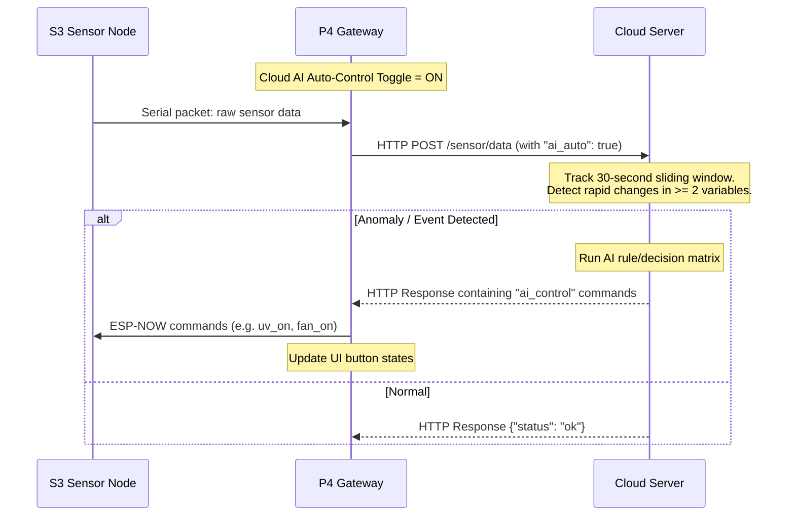

# P4/S3 Gateway Cloud AI Auto-Control Technical Specification

This document details the interface protocol and server-side logic required to implement the **Cloud AI Auto-Control** feature for the E-Nose system.

---

## 1. Feature Architecture

When the **CLOUD AI AUTO** switch is turned **ON** via the P4 UI, the P4 gateway will periodically upload real-time sensor readings to the cloud. The cloud server analyzes the telemetry stream. If it detects rapid fluctuations or large-amplitude changes in at least **two** parameters within a 30-second sliding window, it triggers an AI decision-making routine to control the hardware peripherals (UV light, Fogger/Humidifier, Fan, Lid) and sends the control instructions back to the P4.



---

## 2. P4 Telemetry Request Protocol

The P4 gateway uploads sensor data using the following endpoint:

* **Endpoint**: `POST /sensor/data?key=bigboss&t=<timestamp>`
* **Content-Type**: `application/json`

### Request Body JSON Format
```json
{
  "t": 25.4,
  "hu": 58.2,
  "co2": 476,
  "o": 0.00,
  "h": 43.47,
  "c": 0.00,
  "v": 75.22,
  "cls": "未开封",
  "conf": 0.66,
  "fr": 65,
  "uv_on": false,
  "fog_on": false,
  "fan_on": false,
  "lid_on": false,
  "ai_auto": true
}
```

### JSON Fields Explanation
| Field | Data Type | Description |
|---|---|---|
| `t` | float | Environment Temperature (°C) |
| `hu` | float | Environment Humidity (%RH) |
| `co2` | int | Carbon Dioxide concentration (ppm) |
| `o` | float | Odor sensor reading (ppm) |
| `h` | float | HCHO / Formaldehyde (ppm) |
| `c` | float | CO / Carbon Monoxide (ppm) |
| `v` | float | VOC / Volatile Organic Compounds (ppm) |
| `cls` | string | Current classification output class name |
| `conf` | float | Classification confidence (0.00 - 1.00) |
| `fr` | int | Freshness index (0 - 100) |
| `uv_on` | boolean | Current physical state of UV sterilization light |
| `fog_on` | boolean | Current physical state of Humidifier (Fogger) |
| `fan_on` | boolean | Current physical state of Exhaust Fan |
| `lid_on` | boolean | Current physical state of Chamber Lid |
| `ai_auto` | boolean | **NEW**: True if "Cloud AI Auto-Control" is active |

---

## 3. Server-Side Anomaly Detection Logic (30s Sliding Window)

To implement the "trigger AI decision if $\ge 2$ parameters change too fast or undergo large-amplitude changes in 30 seconds" requirement, the backend server should implement the following logic:

### Step 1: Telemetry Time-Series Cache
Maintain an in-memory sliding window cache (e.g., using Redis Sorted Sets or an in-memory queue) for each device (`did` or client IP). The window should store the sensor readings (`t`, `hu`, `co2`, `o`, `h`, `c`, `v`) received over the last **30 seconds**.

### Step 2: Rate of Change & Amplitude Verification
Upon receiving a new packet where `"ai_auto": true`, query the cached samples from the last 30 seconds for the same device and compute the delta:

$$\Delta X = X_{\text{current}} - X_{\text{oldest\_in\_30s}}$$

An anomaly trigger condition is met if:
$$\text{Count}\left( |\Delta X| \ge \text{Threshold}_X \right) \ge 2$$

#### Recommended Tuning Thresholds (for 30s interval):
* **Temperature (`t`)**: $|\Delta t| \ge 1.5^\circ\text{C}$
* **Humidity (`hu`)**: $|\Delta hu| \ge 5.0\%\text{RH}$
* **CO2 (`co2`)**: $|\Delta co2| \ge 150\text{ ppm}$
* **VOC (`v`)**: $|\Delta v| \ge 15.0\text{ ppm}$
* **HCHO (`h`)**: $|\Delta h| \ge 5.0\text{ ppm}$

### Step 3: AI Control Decision Matrix
When the trigger condition is met, evaluate the current environment state to choose the optimal combo of actuators. Example rules:
* If $co2 > 1000\text{ ppm}$ or $v > 50\text{ ppm}$ $\rightarrow$ Set `fan_on = true`, `lid_on = true` (Ventilate and open chamber).
* If $hu < 45\%$ $\rightarrow$ Set `fog_on = true` (Humidify).
* If abnormal gas compounds are rising ($o$ or $h$ or $c$ increase rapidly) $\rightarrow$ Set `uv_on = true` (Sanitize).

---

## 4. Server-to-Gateway Response Protocol

If the server chooses to execute control actions, it must return the actuator commands in the HTTP response body of the telemetry upload.

* **Response Header**: `Content-Type: application/json`
* **Response Status**: `200 OK`

### Target Response JSON Format
The P4 gateway supports both root-level fields and a nested `ai_control` block. The nested block is recommended:

```json
{
  "status": "ok",
  "ai_control": {
    "uv_on": true,
    "fog_on": false,
    "fan_on": true,
    "lid_on": false
  }
}
```

### Protocol Execution on P4
When the P4 receives a non-null `ai_control` block in the HTTP response:
1. It compares the target states with the current local states.
2. If any target state differs (e.g., `uv_on` goes from `false` to `true`), P4 automatically transmits the serial control command (e.g. `uv_on`) to the S3 receiver board.
3. It updates the P4 touch screen dashboard widgets asynchronously.

---
*Created by Antigravity AI Coding Assistant.*
