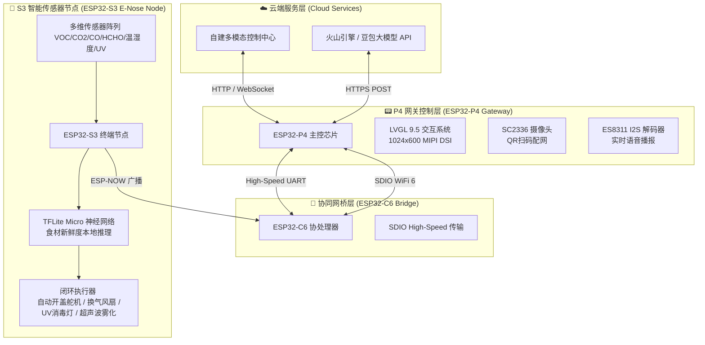
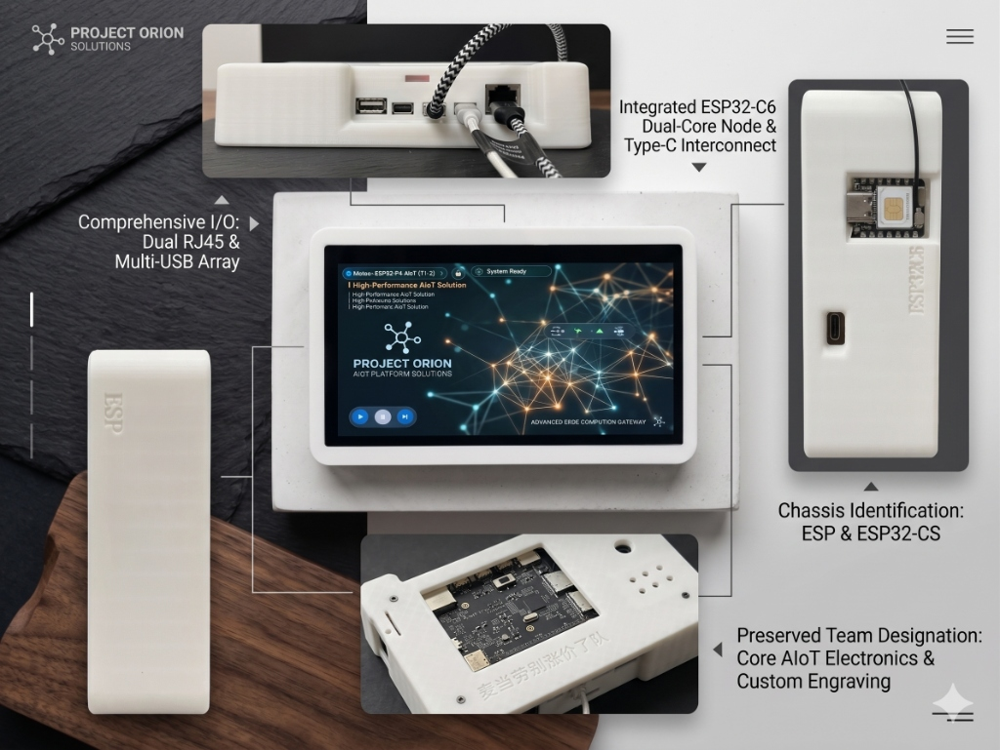
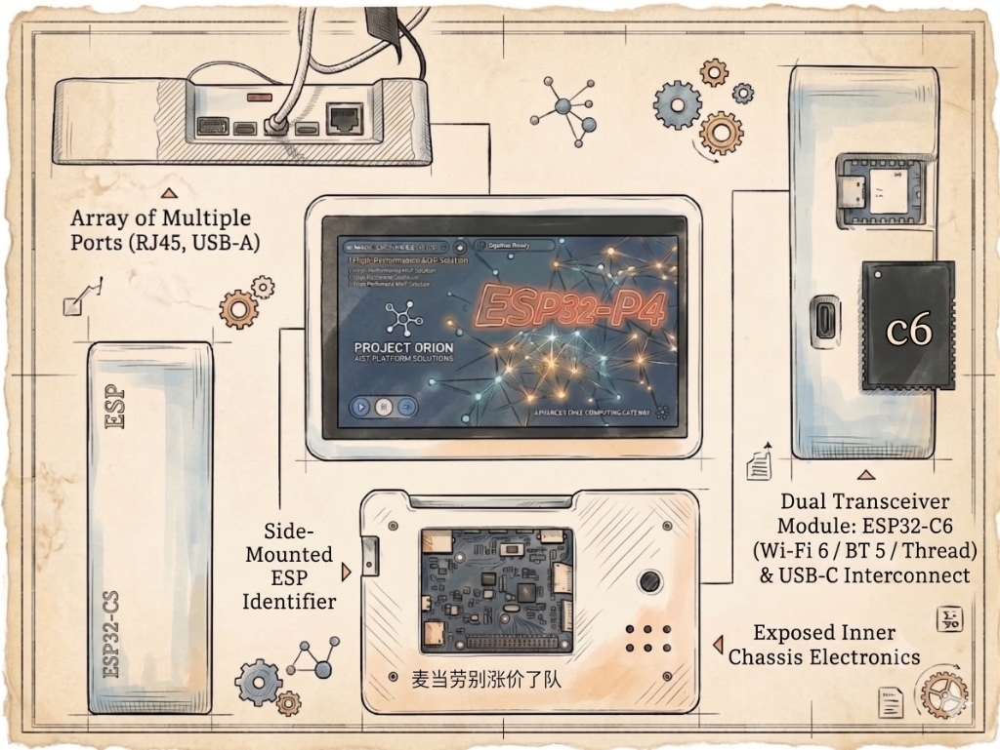

<p align="center">
  
  
</p>

# 🔬 ESP32-P4 + S3 智能机器人嗅觉电子鼻网关系统 (Smart Robot E-Nose Gateway)

<p align="center">
  
  
  
  
  
  
</p>

```text
██████  ██████  ██████  ██████  ██████  ██████  ██  ██          ██████  ██  ██  ██████  ██████  ██████  
██      ██      ██  ██      ██      ██  ██  ██  ██  ██          ██      ███ ██  ██  ██  ██      ██      
██████  ██████  ██████  ██████  ██████  ██████  ██████  ██████  ██████  ██████  ██  ██  ██████  ██████  
██          ██  ██          ██  ██      ██          ██          ██      ██ ███  ██  ██      ██  ██      
██████  ██████  ██      ██████  ██████  ██          ██          ██████  ██  ██  ██████  ██████  ██████  
```

---

## 🌟 项目简介 (Project Overview)

本项目是一款基于 **ESP32-P4 双核 RISC-V 主控**与 **ESP32-S3 边缘 AI 节点**的**智能嗅觉电子鼻与多模态网关系统**。系统通过高频环境传感器采集、边缘端运行的 **TensorFlow Lite Micro (TFLite)** 神经网络模型进行食材新鲜度（如芒果、香蕉、橙子等）的实时推理，并通过 **ESP-NOW + UART 双重网桥**将异构数据汇总至 P4 主控，在 **LVGL 9.5** 交互大屏上进行实时可视化展示，同时提供**云端数据同步、大模型智能空气质量分析及硬件闭环控制**（紫外线消毒、自动换气开盖、加湿雾化）。

---

## 🎨 系统架构 (System Architecture)



---

## 🔥 核心特色 (Key Features)

### 1. 🧠 S3 边缘智能推理 (Edge AI Classifier)
*   **本地 TFLite 推理**：终端节点在 ESP32-S3 上利用 TensorFlow Lite Micro 引擎，直接读取 SD 卡中的 `.tflite` 模型，输入 VOC 气体浓度、甲醛 (HCHO)、一氧化碳 (CO) 等特征值，输出分类结果（如 `mango`, `banana`, `orange`）和置信度分值。
*   **模型热更新 (OTA)**：通过网关下发串口或 ESP-NOW 分包数据，S3 节点可动态接收新编译的模型并热加载（支持最大 512KB 模型文件），在不重新烧录固件的前提下迭代嗅觉算法。

### 2. ⚡ 异构网络网桥 (Dual-Bridge Communication)
*   **ESP-NOW 无线组网**：多路 S3 节点通过超低功耗 of ESP-NOW 广播协议，以扁平化 JSON 包将环境参数及推理结果秒级同步至 C6 桥接器。
*   **SDIO STA 网络隔离**：P4 主控通过 4-bit 高速 SDIO 接口与 C6 协同，实现 WiFi 6 硬件直连，保障网络层数据的安全隔离与零抖动传输。

### 3. 🖥️ LVGL 9.5 视听交互系统 (Premium UI/UX)
*   **高清图形看板**：1024×600 MIPI DSI 屏，以环形动态仪表盘、滑块菜单、实时图表反映各节点气体分布及新鲜度。
*   **扫码配网 (QR Code Wifi Provisioning)**：通过 SC2336 摄像头，扫码解析 WiFi 热点信息并自动配置连接，凭据持久化存入 NVS 闪存。
*   **语音流式合成 (TTS Voice Stream)**：内置 ES8311 音频解码器，将云端下发的报警或健康提示文本通过 Opus 实时音频流还原播放。

### 4. 🎛️ 闭环控制与大模型融合 (Smart Actuators & LLM Gateway)
*   **物理换气与消毒**：当本地推理新鲜度低于安全阈值 (`< 60%`)，S3 节点自动触发继电器点亮 UV 紫外线消毒灯，开启排气风扇并驱动舵机打开舱门通风。
*   **豆包 AI 空气管家**：P4 主控聚合传感器数据后，通过 HTTPS POST 直接与**火山引擎 AI Gateway** 握手，根据专业嗅觉专家提示词，实时输出多维健康评估与空气改善建议。

---

## 📷 系统硬件展示 (System Hardware Gallery)

<p align="center">
  <br/>
  <em>智能嗅觉电子鼻网关系统实物引脚与接口标注图 (Annotated Hardware Map)</em>
</p>

<br/>

<p align="center">
  <br/>
  <em>三维机壳设计与芯片互联图纸 (Blueprint Schematic Sketch)</em>
</p>

---

## 🛠️ 硬件与传感器规格 (Hardware Specifications)

| 硬件模块 (Module) | 型号 / 接口 (Interface) | 核心功能 (Function) |
|---|---|---|
| **主控核心** | ESP32-P4 (双核 RISC-V 400MHz, 16MB PSRAM) | 图形渲染、大模型对接、系统调度 |
| **协处理器** | ESP32-C6 (RISC-V, WiFi 6 + BLE + ESP-NOW) | SDIO 网卡、ESP-NOW 信号汇总桥接 |
| **边缘智能节点** | ESP32-S3 (双核 Tensilica, 8MB PSRAM) | 模拟气体采集、边缘神经网络推理 |
| **显示模组** | 7寸 1024×600 MIPI DSI / GT911 触摸 | LVGL 图形化控制面板 |
| **摄像头模块** | SC2336 (MIPI CSI 接口, 1280x720 50fps) | QR 扫码配网 |
| **音频放大解码** | ES8311 Codec + AW88298 功放 (I2S) | 播报声音流播放 |
| **高精度 ADC** | ADS1115 (16-bit 精度 I2C 接口) | 差分采集半导体气体传感器微弱变化 |
| **二氧化碳检测** | MH-Z19C NDIR 红外传感器 (UART) | CO₂ 浓度高精度检测 |
| **温湿度气压** | BME680 (I2C 接口) | 环境基础气压、温湿度补偿 |
| **多气味传感器** | MQ 系列半导体气敏元件阵列 | VOCs, 甲醛, 一氧化碳, 有害气体监测 |
| **物理执行机构** | SG90 舵机 + UV 继电器 + 直流风扇 | 舱门开合、通风排毒、紫外消毒、加湿 |

---

## 💎 底层软件优化与稳定性黑科技 (Software Optimizations)

> [!IMPORTANT]
> **SRAM 极度紧张下的内存腾挪方案**
> * **PSRAM 显示缓冲区托管**：将 LVGL 9.5 的双显绘图缓冲区移至外部 PSRAM (`.buff_spiram = true`)，直接为内部 RAM **释放了 82KB 以上**的连续物理空间，保障了 I2S DMA 和摄像头高速缓存的零拷贝申请。
> * **SDIO 零拷贝 DMA 对齐限制**：ESP-Hosted 传输协议的接收/发送缓冲区被限制在内部 SRAM 分配（非 PSRAM），避免了硬件层面缺少 L2 Cache 一致性机制导致的 SDIO 握手死锁与超时错误（258 Error）。

> [!TIP]
> **FreeRTOS 任务安全销毁与防死锁机制**
> * **双重删除防护 (Double-Delete Guard)**：通过在任务退出循环后，主动置空全局 TaskHandle 句柄 (`s_task_handle = NULL`) 之后再调用 `vTaskDelete(NULL)`，根除了多线程调度下因延迟销毁导致的 Core 0 / Core 1 访存冲突（Load access fault / Guru Meditation Panic）。
> * **优雅关闭同步机制**：在 XiaoZhi 语音服务重启时，通过延时等待周期，给 I2S 解码器和 WebSocket 线程留出资源释放时间，防止突发的 Force-Delete 破坏 I2S 硬件通道的 Mutex 锁结构，杜绝播放完声音后的系统假死问题。

---

## 🚀 快速开始与编译 (Getting Started)

### 1. 克隆项目 (Clone Repository)
```bash
git clone https://github.com/jingkaiyin4-dot/ESP32-P4-ENOSE.git
cd ESP32-P4-ENOSE
```

### 2. 编译环境要求 (Environment)
*   **ESP-IDF**: `v5.5.3` (或更高稳定版)
*   **编译目标**: `esp32p4`

### 3. 配置与构建 (Build & Flash)
```bash
# 1. 首次构建前清理并自动生成本地 sdkconfig / Re-generate configurations
rm -f sdkconfig
idf.py set-target esp32p4

# 2. 编译工程 / Build
idf.py build

# 3. 烧录固件与启动监控 / Flash and monitor
idf.py flash monitor
```

> [!WARNING]
> **首航运行注意**
> 项目出于安全考虑，已对共享代码中的**云端多模态控制 IP 地址**与**火山大模型 sk 凭证**进行了 `*` 号脱敏处理。编译前，请在您的本地 `sdkconfig` 中（或在 `sdkconfig.defaults` 的第 172-173 行）填入您真实的 API 地址和密钥。

---

## 📂 项目关键代码结构 (Directory Layout)

```
ESP32-P4-ENOSE/
├── main/
│   ├── main.cpp                # 系统入口、外设挂载与任务创建
│   ├── ui.cpp / ui.h           # LVGL UI 交互核心逻辑 (仪表盘、控制中心)
│   ├── cloud_sync.cpp/h        # 云端同步轮询任务、AI 结果异步推送
│   ├── xiaozhi_ai_service.c    # 语音流式合成客户端、Websocket 长连接管理
│   ├── model_mgr.cpp           # S3 推理模型的本地存储与固件升级
│   └── volcano_rtc_service.c   # 实时语音对话驱动服务
├── components/
│   ├── electronic_nose_gateway # 电子鼻网关大模型请求封装组件
│   ├── bsp_extra               # MIPI 显示和 GPIO 扩展适配组件
│   └── micro_opus              # Opus 音频编解码核心硬件/软件算法组件
├── S3-core/                    # ESP32-S3 传感器推理终端源码
│   ├── espnow-receiverv2-s3.ino# S3 终端主入口 (传感器轮询与决策)
│   ├── model_runner.h          # TFLite Micro 引擎封装与新鲜度评估
│   └── model_updater.h         # 基于分包广播的模型热加载接收器
└── partitions.csv              # 16MB Flash 自定义分区表
```

---

## 📈 项目开发路线图 (Roadmap)

- [x] 基于 TFLite Micro 的边缘气味新鲜度识别
- [x] ESP-NOW 无线多节点网络组网与 UART 桥接
- [x] LVGL 9.5 多交互主页与亮度/音量控制
- [x] 大模型 API 对接与空气管家智能决策
- [x] 音频流接收解码与实时流式 TTS 播放
- [x] 基于 SD 存储卡的多 TFLite 模型文件本地存储与切换
- [x] NVS 凭证持久化及扫码配网
- [x] 闭环舱门开闭及消毒联动
- [ ] 针对气敏元件老化的温湿度硬件零点校准算法
- [ ] 通过云端进行无线固件整包 OTA 升级
