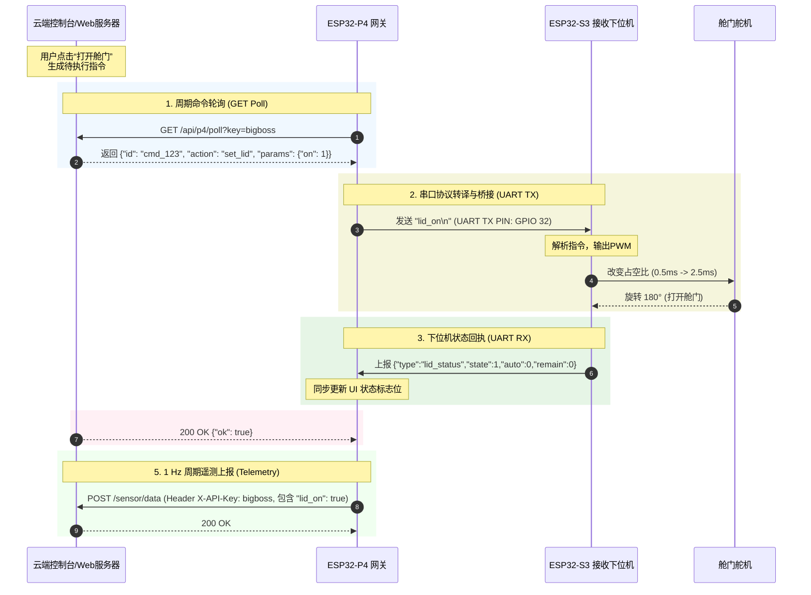

# 🛰️ ESP32-P4 舱门舵机云端控制协议规格书

> **版本**：v2.2 (生产联调与硬件调试版) | **基准端口**：`80` (通过 Nginx `/api` 路由反代)  
> **全局认证 Key**：`bigboss` (URL 参数 `?key=bigboss` 或请求头 `X-API-Key: bigboss`)

---

## 1. 系统架构与控制闭环

物理实验盒系统采用双 MCU 分离式架构：
* **ESP32-P4 网关**：负责高分辨率 LCD 屏幕渲染 (LVGL)、AI 推理 (TFLite)、Wi-Fi 与云端 HTTP 链路维护，并充当串口控制桥梁。
* **ESP32-S3 接收下位机**：负责直接驱动强电/弱电执行机构，包含舱门舵机 (Servo Lid)、紫外线灯 (UV)、雾化加湿器 (Fogger) 及 12V 散热风扇 (Fan)。

本规格书定义的舱门舵机控制，遵循 **“定时轮询 (Poll) -> 串口桥接 -> 硬件执行 -> 确认反馈 (ACK) -> 定期上报 (Telemetry)”** 的标准闭环控制流程。



---

## 2. 云端-网关接口规格详解

### 2.1 舱门状态上报 (周期遥测 - Telemetry)
网关定时以 1 Hz 频率上报最新的传感器数据和硬件状态键值对。

* **接口地址**：`POST http://*.*.*.*/sensor/data` <!-- Censored Server API / 已脱敏服务器API -->
* **请求头 (Headers)**：
  ```http
  Content-Type: application/json
  X-API-Key: bigboss
  ```
* **请求体示例 (JSON)**：
  ```json
  {
    "t": 24.4,
    "hu": 58.2,
    "co2": 669,
    "o": 6.0,
    "h": 0.1,
    "c": 17.2,
    "v": 20.6,
    "cls": "banana_fresh",
    "conf": 1.00,
    "fr": 50,
    "uv_on": false,
    "fog_on": false,
    "fan_on": false,
    "lid_on": true
  }
  ```
* **核心字段映射表**：
  | 网关字段 | 服务端数据库字段 | 数据类型 | 含义 | 范围/说明 | 示例值 |
  | :--- | :--- | :--- | :--- | :--- | :--- |
  | **`lid_on`** | `lid_state` | Boolean | 舱门舵机当前状态 | `true` (开启) / `false` (关闭) | `true` |

---

### 2.2 云端控制命令下发方式

#### 2.2.1 方式 A：HTTP 周期轮询 (GET Poll)
网关每 5 秒（正常状态）或 1 秒（快速执行状态）向云端拉取是否有排队中的指令。

* **接口地址**：`GET http://*.*.*.*/api/p4/poll?key=***` <!-- Censored Server API / 已脱敏服务器API -->
* **服务端无待执行命令时的响应 (200 OK)**：
  ```json
  {
    "id": null
  }
  ```

#### 2.2.2 方式 B：WebSocket 实时命令推送 (WebSocket Push)
为实现毫秒级的超低延迟控制，网关与云端维持一条长连接通道。云端可直接通过 WebSocket 链路下发 `command` 类型的命令数据。

* **WebSocket 连接 URL**:
  ```
  ws://*.*.*.*/api/p4/ws?device_id=esp32-xxx&device_type=esp32_p4&firmware_version=1.0.0 <!-- Censored Server API / 已脱敏服务器API -->
  ```
* **控制指令推送格式 (JSON)**：
  ```json
  {
    "msg_id": "push_cmd_1780302494485",
    "type": "command",
    "timestamp": 1686123456789,
    "data": {
      "action": "set_lid",
      "params": {
        "on": 1
      }
    }
  }
  ```

#### 2.2.3 控制指令 action 负载规格详情

##### 场景 A：手动控制开关舱门 (标准对象化参数 - `action: "set_lid"`)
* **params 载荷**：`{"on": 0/1}`
  ```json
  {
    "id": "cmd_1780302494485",
    "action": "set_lid",
    "params": {
      "on": 1
    }
  }
  ```
  *(注：`on: 1` 代表打开舱门；`on: 0` 代表关闭舱门。网关支持 cJSON 对该参数的 `cJSON_True`/`cJSON_False` 与 `cJSON_Number` 兼容解析)*

##### 场景 B：手动开关舱门 (快捷动作参数 - `action: "lid_on" / "lid_off"`)
为兼容部分旧版平台下发，网关同样内置支持无参的快捷开关动作。
* **params 载荷**：无需参数或空对象 `{}`
  ```json
  {
    "id": "cmd_1780302494486",
    "action": "lid_on",
    "params": {}
  }
  ```

##### 场景 C：切换智能联动通风模式 (`action: "lid_auto_on" / "lid_auto_off"`)
* **作用说明**：通知设备端开启或关闭“AI 新鲜度低自动开仓通风”的本地闭环策略。启用后，当下位机检测到食物新鲜度（`fr` 评分）评分低于阈值（如 `<=40`）时，下位机本地自动开盖通风；当分值恢复后自动关盖，无需服务器实时干预。
* **params 载荷**：无需参数
  ```json
  {
    "id": "cmd_1780302494487",
    "action": "lid_auto_on",
    "params": {}
  }
  ```

##### 场景 D：强制拉取下位机状态 (`action: "lid_status"`)
* **作用说明**：命令网关向下位机发送状态索要请求，下位机将通过串口返回最新的工作参数，强制同步数据。
* **params 载荷**：无需参数
  ```json
  {
    "id": "cmd_1780302494488",
    "action": "lid_status",
    "params": {}
  }
  ```

---

### 2.3 命令确认反馈 (回执确认 - ACK)
网关将接收到的命令向串口（或本地）派发并执行后，必须回复 ACK 报文，以便服务端将队列中的命令标记为“已完成”。

* **接口地址**：`POST http://*.*.*.*/api/p4/ack?key=***` <!-- Censored Server API / 已脱敏服务器API -->
* **Content-Type**：`application/json`

#### 成功开启舱门回执示例：
```json
{
  "id": "cmd_1780302494485",
  "accept": true,
  "result": {
    "lid_on": true
  },
  "reason": ""
}
```

#### 执行失败/错误回执示例 (例如下位机断线或超时)：
```json
{
  "id": "cmd_1780302494485",
  "accept": false,
  "result": {},
  "reason": "Receiver offline / ESP-NOW command transmission timeout"
}
```

---

## 3. 网关-下位机串行协议规格 (UART)

ESP32-P4 与 ESP32-S3 接收板之间使用串行接口连接（配置为 115200 bps, 8N1）。

### 3.1 网关下行控制帧 (下发至 S3)
网关在解析出云端控制指令或用户屏幕交互后，向串口发送明文指令行，每行以 `\n` 结尾：
* 打开舱门：`lid_on` 或 `lid on`
* 关闭舱门：`lid_off` 或 `lid off`
* 开启自动开仓联动：`lid_auto_on` 或 `lid auto on`
* 关闭自动开仓联动：`lid_auto_off` 或 `lid auto off`
* 索要当前舱门状态：`lid_status` 或 `lid status`

---

### 3.2 下位机上行状态帧 (反馈至 P4)
当收到 `lid_status` 命令，或舱门状态发生跃变时，下位机 ESP32-S3 向 P4 回发 JSON 行报文：
* **数据流格式**：
  ```json
  {"type":"lid_status","state":1,"auto":0,"remain":0}
  ```
* **字段详解**：
  * `type`：固定为 `"lid_status"` 字符串。
  * `state`：整型。`1` 代表舱门开启（舵机置于工作位，如 180°）；`0` 代表舱门关闭（舵机置于归零位，如 0°）。
  * `auto`：整型。`1` 代表启用低新鲜度自动通风联动机制；`0` 代表仅允许手动云端控制。
  * `remain`：整型。如果在下位机侧配置了定时通风功能，则返回剩余开启秒数（`0` 代表无倒计时，长开）。

---

## 4. 外设控制指令集设计矩阵 (对比参考)

为使服务器后端能使用一致的接口调用，特将舱门舵机、风扇、UV灯等外设的命令矩阵汇总如下：

| 物理执行器 | 手动开关控制 Action (带 params.on) | 手动快捷指令 Action (免参/只读) | 定时关闭设置 Action (分钟参数) | 本地自动联动 Action (阈值逻辑) | 遥测反馈字段 |
| :--- | :--- | :--- | :--- | :--- | :--- |
| **舱门舵机** | `set_lid` (`{"on": 0/1}`) | `lid_on` / `lid_off` | *(未定义定时)* | `lid_auto_on`/`lid_auto_off`<br/>*(联动新鲜度<=40)* | `"lid_on"` |
| **排风风扇** | `set_fan` (`{"on": 0/1}`) | `fan_on` / `fan_off` | `fan_dur` (`{"duration": N}`) | `fan_auto_on`/`fan_auto_off`<br/>*(联动新鲜度<=50)* | `"fan_on"` |
| **雾化加湿器**| `set_fog` (`{"on": 0/1}`) | `fog_on` / `fog_off` | `fog_dur` (`{"duration": N}`) | `fog_auto_on`/`fog_auto_off`<br/>*(联动湿度<40%RH)* | `"fog_on"` |
| **紫外杀菌灯**| `set_uv` (`{"on": 0/1}`) | `uv_on` / `uv_off` | `uv_dur` (`{"duration": N}`) | `uv_auto_on`/`uv_auto_off`<br/>*(联动定时消毒)* | `"uv_on"` |

---

## 5. 嵌入式系统专家调试与排错指南

为了确保在硬件联调和生产测试阶段，舵机开关和状态上报的稳定运行，需重点排查以下嵌入式设计痛点：

### 5.1 硬件电路与电气特性设计建议
1. **舵机瞬态大电流隔离 (Critical)**
   * **现象**：舵机（如 MG996R 等高舵量舵机）在启动瞬间或发生机械卡死（Stall）时，瞬态浪涌电流可能高达 1.5A ~ 2.5A。
   * **隐患**：如果舵机电源与 ESP32-S3 或 ESP32-P4 的系统 3.3V/5V 数字电源共用且没有足够的滤波，会造成 VCC 电压瞬间跌落，触发 MCU 的 **欠压复位 (Brown-out Reset, BOR)**。
   * **整改方案**：
     * **强弱电隔离电源**：舵机驱动电源必须直接取自 5V 开关电源/外部适配器输出端，避免经过板载 LDO。
     * **并联大电容**：在舵机电源插针就近并联一颗 470μF ~ 1000μF 的低 ESR 电解电容，以及一颗 100nF 的瓷片去耦电容，吸收电感性负载的瞬态浪涌。
2. **逻辑电平匹配**
   * ESP32-S3 的 GPIO 驱动输出为 3.3V TTL 电平。如果所选舵机的 PWM 控制引脚强制要求 5V CMOS 电平输入，需在 GPIO 与舵机信号脚之间增加单向高速电平转换电路（如双极性三极管或 TXS0108 转换芯片），以防占空比抖动或识别失败。
3. **GPIO 初始上拉/下拉**
   * 在 MCU 刚刚上电、IO 口处于高阻输入态（High-Z）时，寄生电荷可能导致舵机信号线产生杂散窄脉冲，引起舱门“抽搐/抖动”。建议在舵机 PWM 控制引脚上并联一颗 10kΩ 的下拉电阻，强制其初始化为低电平。

### 5.2 示波器 / 逻辑分析仪抓包与波形验证
1. **UART 串口通信报文校验**
   * **探针挂载**：使用逻辑分析仪挂载在 P4 核心板的 `TXD1` (GPIO 32) 和 `RXD1` (GPIO 36) 引脚。
   * **解码配置**：波特率 115200，8 数据位，无校验，1 停止位。
   * **排查重点**：
     * 确认网关发送的指令（如 `"lid_on\n"`）尾部带有换行符 `0x0A ('\n')`，这是下位机断帧的关键标识。
     * 观察串口波形是否因为静电干扰出现毛刺。如果出现误码，检查信号地（GND）是否完全共地。
2. **舵机 PWM 波形脉宽校验**
   * **探针挂载**：使用示波器单通道挂载在下位机 S3 输出至舵机信号线的引脚上。
   * **参数验证**：
     * **频率**：周期必须为 20ms (即 50 Hz)。
     * **脉宽范围**：当云端下发 `on: 1` 时，测量高电平维持时间是否跃变至约 2.5ms（工作位）；下发 `on: 0` 时维持时间是否回到 0.5ms（初始归零位）。
     * **抖动测试**：在网关进行 Wi-Fi 高频数据上报的瞬间，观察 PWM 高电平脉宽是否有超过 ±10μs 的时基抖动（Jitter）。若有，下位机输出 PWM 需采用硬件 MCPWM 模块，严禁使用软件定时器模拟。

### 5.3 FreeRTOS 任务栈深度与内存泄漏监测
1. **任务栈溢出排查 (Stack Overflow)**
   * **分析**：网关的 `cloud_sync_task` 需要解析复杂的云端 cJSON 报文，cJSON 对栈空间的消耗极大。
   * **建议**：
     * 确保 `cloud_sync_task` 在创建时分配的栈深度不低于 4KB（即 `4096` 字节）。
     * 开启 FreeRTOS 的栈溢出钩子函数：在 `sdkconfig` 中配置 `CONFIG_FREERTOS_WATCHPOINT_END_OF_STACK=y` 和 `CONFIG_FREERTOS_STACK_LIMIT_TO_STACK_POINTER=y`。
     * 生产运行调试时，通过调用 `uxTaskGetStackHighWaterMark(NULL)` 打印任务剩余栈的最小水位，确保其值始终大于 500 字节。
2. **堆内存碎片化与泄漏防范 (Heap Leak)**
   * **警惕**：cJSON 树的解析必须伴随成对的资源释放。在 `handle_set_lid` 里的任何提前 return 语句分支前，都必须调用 `cJSON_Delete()` 以及 `free(payload)`，否则会导致系统堆内存不断耗尽直至 Crash 重启。
   * **监测命令**：在空闲循环或上报定时器中插入 `esp_get_free_heap_size()`，观测设备连续运行 24 小时后的堆内存大小，若呈现锯齿状下降趋势，则表明存在内存泄漏。
